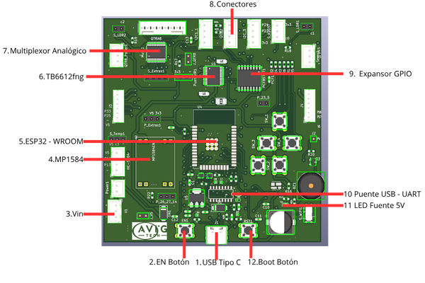

ESP32 - STEM v1
===============

Esta guía muestra como utilizar la placa de desarrollo ESP32 STEM de AVIG TECH

**Qué necesitas**
-----------------

* USB 2.0 Tipo C
* Computador con sistema operativo  Windows, Linux o MacOS
* Placa de desarrollo ESP32 - STEM V1

**Descripción General**
-----------------------

La placa de desarrollo basada en ESP32 WROOM ha sido diseñada como una solución integral para 
proyectos de educación STEM, robótica e IoT. Este dispositivo combina conectividad inalámbrica 
(WiFi y Bluetooth), capacidad de procesamiento en tiempo real y una arquitectura flexible que 
permite interactuar con sensores, actuadores y sistemas externos.

Su diseño está orientado a facilitar el aprendizaje progresivo, desde conceptos básicos de 
electrónica y programación hasta la implementación de sistemas avanzados como comunicación MQTT,
integración con ROS 2 y desarrollo de interfaces HMI. Gracias a su compatibilidad con entornos 
como Arduino, MicroPython y frameworks IoT, la placa se convierte en una herramienta versátil 
tanto para estudiantes como para desarrolladores.

Componentes principales
-----------------------

   ESP32 STEM V1

Entre los principales elementos que incorpora se encuentran: 

.. list-table::
   :header-rows: 1
   :widths: 8 28 66
   :class: fit-table

   * - N
     - Elemento
     - Descripción
   * - 1
     - Puerto USB Tipo C
     - La comunicación serial se puede realizar en base a tipo C
   * - 2
     - Botón EN
     - Botón de reinicio del sistema. Al presionarlo, reinicia el ESP32 y reinicia la ejecución del programa cargado.
   * - 3
     - Entrada VIN
     - Terminal de alimentación externa. Permite alimentar la placa con una fuente de voltaje externa, que posteriormente es regulada para el correcto funcionamiento del sistema.
   * - 4
     - Regulador MP1584
     - Convertidor DC-DC step-down encargado de regular el voltaje de entrada a niveles adecuados para el sistema (5V / 3.3V).
   * - 5
     - Módulo ESP32-WROOM
     - Microcontrolador principal del sistema. Integra WiFi, Bluetooth, CPU de doble núcleo y periféricos necesarios para aplicaciones IoT y robótica.
   * - 6
     - Driver TB6612FNG
     - Controlador de motores DC de doble canal. Permite controlar dirección y velocidad mediante señales PWM desde el ESP32. Voltaje de operacion de 2.5 a 13 [v] y 1.2 [A] nominal por canal.
   * - 7
     - Multiplexor Analógico 
     - Multiplexor analógico de 16 canales que permite expandir las entradas analógicas del ESP32.
   * - 8
     - Conectores de E/S
     - Interfaces físicas para conexión de sensores y actuadores. Distribuyen señales de alimentación, tierra y pines GPIO del ESP32.
   * - 9
     - Expansor GPIO
     - Expansor de pines digitales (PCF8574T) mediante comunicación I2C, utilizado para aumentar la cantidad de entradas/salidas disponibles.
   * - 10
     - Puente USB a UART
     - Chip encargado de la conversión USB a comunicación serial UART, utilizado para la programación y depuración del ESP32.
   * - 11
     - LED de alimentación 5V
     - Indicador visual que se enciende cuando la placa está correctamente alimentada.
   * - 12
     - Botón Boot
     - Botón utilizado para entrar en modo de programación. Se emplea junto con el botón EN para cargar firmware en el ESP32.

A continuación, se presentan las hojas de datos oficiales de los principales componentes utilizados en la placa:

TB6612FNG (Driver de motores) 

:download:`Ficha Técnica TB6612FNG <../../_static/TB6612FNG.pdf>`

CD74HC4067SM (Multiplexor analógico)

:download:`Ficha Técnica CD74HC4067SM <../../_static/CD74HC4067SM.pdf>`

PCF8574T (Expansor GPIO I2C)

:download:`Ficha Técnica PCF8574T <../../_static/PCF8574T.pdf>`

MP1584 (Regulador DC-DC Step-Down)

:download:`Ficha Técnica MP1584 <../../_static/MP1584.pdf>`