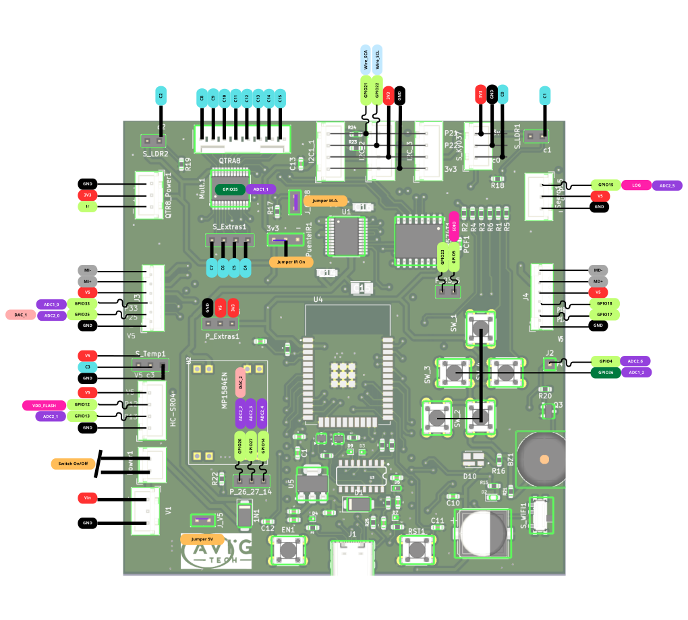

Diseño de pines para prototipado
================================

Los pines de la placa ESP32 STEM puede usarse en su mayoría como pines de una ESP32-WROOM normal.
A continuación, el uso respectivo de cada una para configuraciones adicionales y proyectos independientes.

Además, se detalla los pines y direcciones del multiplexor analógico CD74HC4067SM así como los del expansor de GPIO i2c PCF8574T

   ESP32 STEM V1

.. tip::
   El GPIO12 tiene una resistencia de 10k que al arrancar el circuito lo forza para no tener un reset de la ESP32

Control del  CD74HC4067SM y PCF8574T
------------------------------------

La dirección del PCF8574T es, los GPIO del chip controlan la dirección del multiplexor y EN del driver TB6612FNG según el siguiente detalle

Además, la lectura del multiplexor se realiza a travès del pin GPIO36

Instalación de plataforma Arduino IDE
-------------------------------------

La placa de desarrollo AVIG TECH STEM - puede ser programada a través de los siguientes software:

* Arduino IDE
* EspressIf IDE
* PlataformIO

A continuación, se muestra la recomendación para su uso con Arduino IDE:

